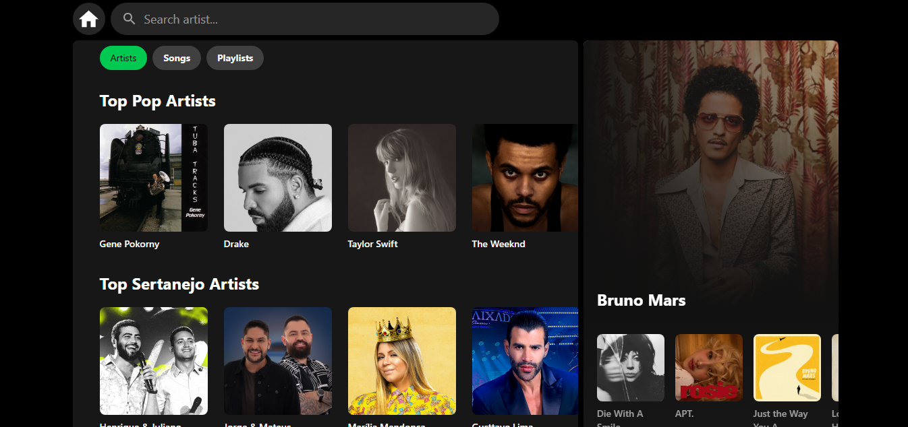

# 📊 TopTracker

**TopTracker** é uma aplicação web desenvolvida com **React** e **Vite**, focada em exibir dados de forma clara e responsiva, com foco em rankings, rastreamento de informações ou visualização de desempenho (dependendo da lógica implementada).

## 🖥️ Captura de Tela

Veja abaixo um exemplo da interface da aplicação:



## 🚀 Tecnologias Utilizadas

- [React](https://reactjs.org/)
- [Vite](https://vitejs.dev/)
- [JavaScript (ES6+)](https://developer.mozilla.org/pt-BR/docs/Web/JavaScript)
- [TailwindCSS](https://tailwindcss.com/)
- [Vercel](https://vercel.com/)

## 📦 Como Rodar o Projeto Localmente

1. **Clone o repositório**

   ```bash
   git clone https://github.com/seu-usuario/TopTracker.git
   cd TopTracker/frontend
   ```

2. **Instale as Dependências**

  ```bash
  cd frontend
  npm i
  ```

3. **Inicie o servidor de desenvolvimento**

  ```bash
  npm run dev
  ```
